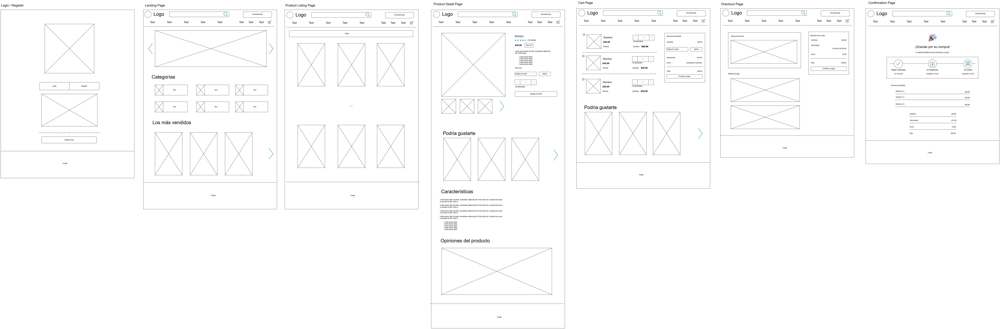

# Puzzle Shop 🧩

Puzzle Shop is a minimalist e-commerce project focused on selling twisty puzzles, Rubik’s cubes, and mechanical brain teasers. Built as part of a personal challenge, it aims to implement core e-commerce features including:

- Product categorization (stickerless, carbon fiber, stickered, etc.)
- Product ratings and reviews
- Discount and coupon systems
- Shipping and order management

## 🛠️ Tech Stack

- 💻 **Frontend**: Nuxt 3 with TypeScript and Composition API using the <script setup> syntax. Pinia is used for state management and Axios for communicating with the backend. The app is rendered using Server-Side Rendering (SSR) for SEO optimization.

- 🧠 **Backend**: NestJS written in TypeScript, structured in modules and services. MongoDB integration is handled via the @nestjs/mongoose package, encapsulating Mongoose schemas and logic cleanly within the framework.

- 🗄️ **Database**: MongoDB, used to persist product data, user accounts, orders, reviews, and coupons. Mongoose provides schema-based validation and querying.

- 🔐 **Authentication**: Cookie-based sessions for user authentication and persistent login states.

- 💳 **Payments**: Planned integration with a payment provider (e.g., Stripe or MercadoPago) for secure checkout and transaction handling.

- 📦 **Architecture**: Monorepo setup with separate frontend and backend directories managed in a single Git repository.

## 📸 Mockup



## 🚀 Getting Started

You can clone the repo and run backend and frontend independently:

```bash
git clone https://github.com/angelchavez19/puzzle-shop.git
cd puzzle-shop
# navigate to frontend or backend to install and run
```

## 📅 Challenge Info

This project is part of the #HagaseUnEcommerceChallenge — a daily challenge to build the base of an e-commerce platform.

---

Made with 💡 and a ❤️ for puzzles.
